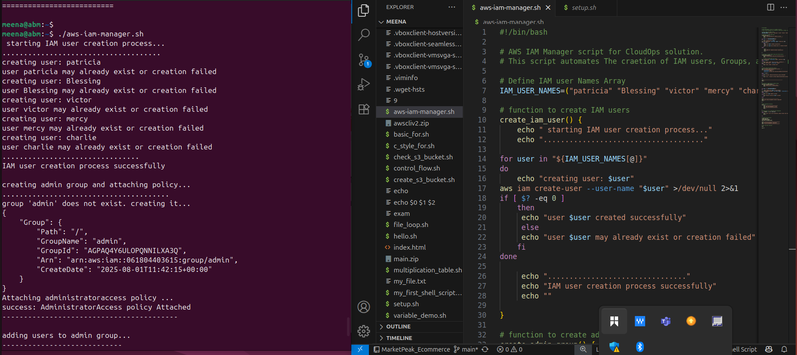

# Shell_script_For_AWS-IAM

# Objective 
As CloudOps Solutions scales, managing IAM users manually becomes inefficient and error-prone. The goal is to automate the creation of:

IAM Users

Admin group

Permission assignments (AdministratorAccess)

This reduces onboarding time for new DevOps team members and ensures consistent permission configurations.

## Deveopment Process 
1. User Planning

Decided to use a Bash array to store 5 sample IAM user names.

Chose meaningful names: patricia, Blessing, victor, mercy, charlie.

2. Function Breakdown

Script modularized into 3 functions for clarity and reusability:

 create_iam_users(): Loops through the user array and creates each IAM user.

create_admin_group(): Checks for group existence; creates if missing and attaches AdministratorAccess policy.

add_users_to_admin_group(): Adds each user to the admin group.

3. Main Function Flow

Script first checks if AWS CLI is installed.

Functions are invoked in a clean main() block.

Error handling and echo statements used throughout for clarity.

## Result
Script successfully:

Created users (if not already created)

Created and configured the "admin" group

Attached AdministratorAccess

Assigned users to the group

